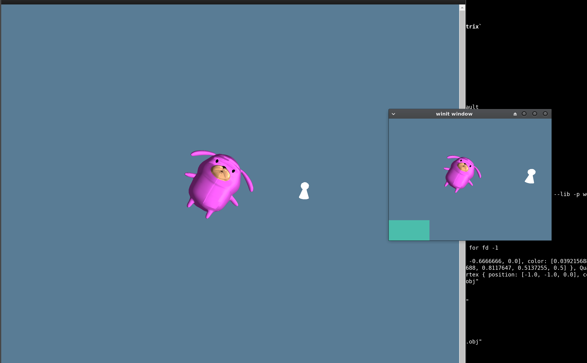

# WGPU

Highly experiemental code using Rust, wgpu, winit, and WebAssemly (wasm) to create cross platform native and web based rendering with the same code.
The code on the web will try to utilize the new WebGPU or if that does not exist WebGL.
The shaders are written using the new WGSL shader langauge that is a part of the new WebGPU spec.

There is a lot of experiemental and commented out code. This is all for learning purposes and trying to get familiar with graphics programming
using WebGPU and wgpu.

## Instructions

Running the native desktop version requires having Rust installed. You can either `cargo build` the project and run the executable 
generated in `target` directory or you can simply just run `cargo run` to open the winit window and run the renderer. 

This project was built using Rust version `1.75.0 (82e1608df 2023-12-21)`

Running on the web using WebAssembly (wasm)

Building for web
-----
You will need to have `wasm-pack` instead and then you should be able to just compile to wasm using the command
`wasm-pack build --target web`
This will pacakge the wasm module and the Javascript glue code inside the `pkg` directory. There is also an `index.html` file 
in the root of the project the references this file.

The above instructions are only if you want to build the project yourself or you want to make changes to the code and reb-build.

Running on the web
-----
Once the wasm files are compiled you can run any local web server and load the index.html file.
For example using node/npm you can run `npx serve .`

Since the files have already been compiled you don't need to have `wasm-pack` or even Rust instead in order to run the 
web/wasm based version. Just run a local server and view `index.html`

### Example

An example of the renderer running on the Web (left) and Native Desktop (right)

